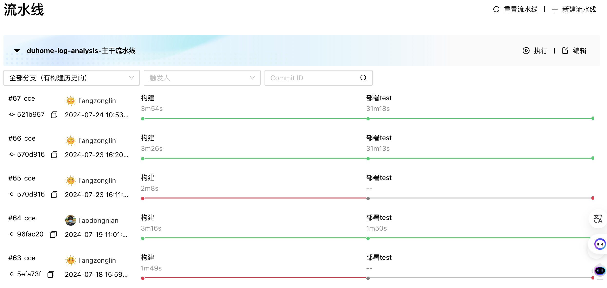
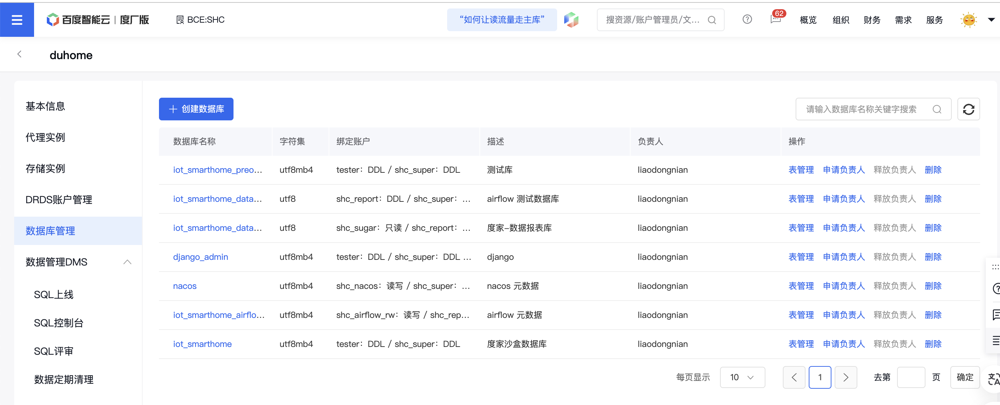
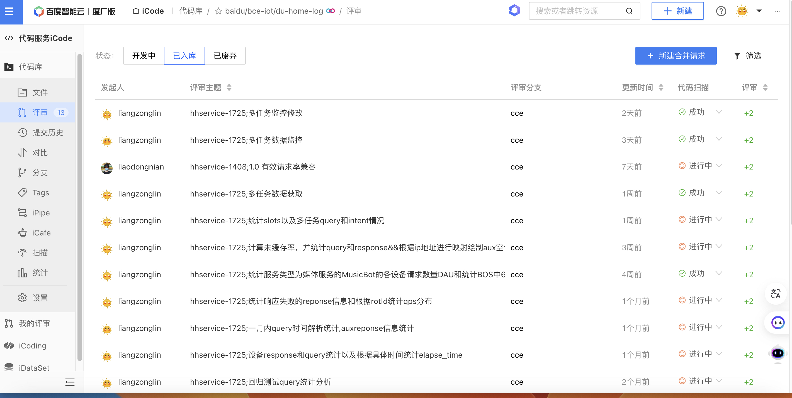
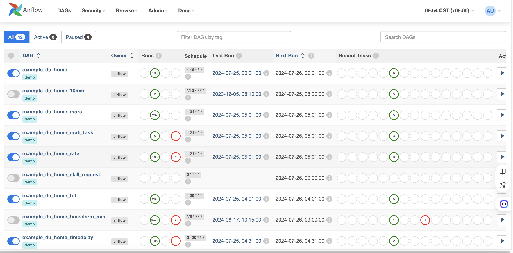
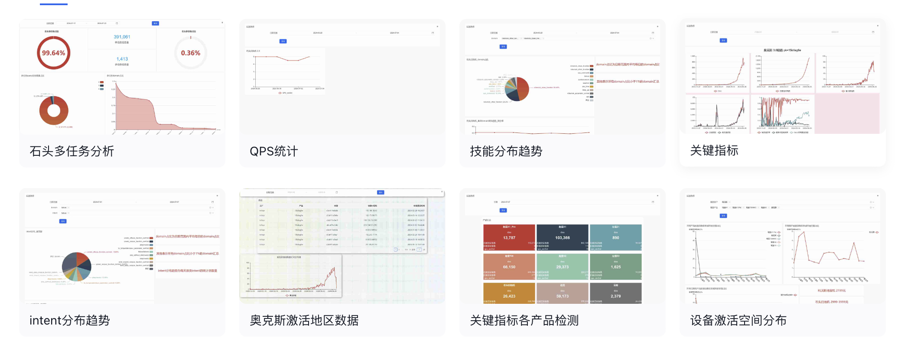

# 实习主要工作

主要工具：

- 编程语言：python
- 相关库：pytorch、pandas、numpy、sklearn、elasticSearch、airflow等
- 相关平台：sugerBI、Kibana、百度icode、airflow等
- 其他：git、bos、pipeline等

## 维护开发数据分析平台

- 主要包括，修复数据分析平台bug
- 定期维护数据分析平台
- 开发新的数据分析功能，并部署上线
- 管理线上数据库，完成日常sql操作

## 数据爬取

利用python、pandas和DrissionPage等数据分析与爬取工具，去定时爬取PM所需数据。

## 数据分析与统计

- 利用python、pandas、numpy、elasticSearch、Kinaba等工具。共完成近20多项数据分析和统计任务，其中包括提取日志中关键信息并聚合统计，拉取云端数据进行按日期统计，分析DUA指标异常增长现象、分析回归测试报告、分析后端接口授权状况等。

  

## 任务调度

- 编写python定时任务，利用airflow，进行定时任务调度管理

## 数据监控

- 在sugerBI平台，利用sql语句建立数据模型，进而进行可视化监控。

## 算法

利用python、pytorch、nunpy等工具完成如下工作：

- 设计query异常检测算法
- 维护管理度家语音识别算法的运行。